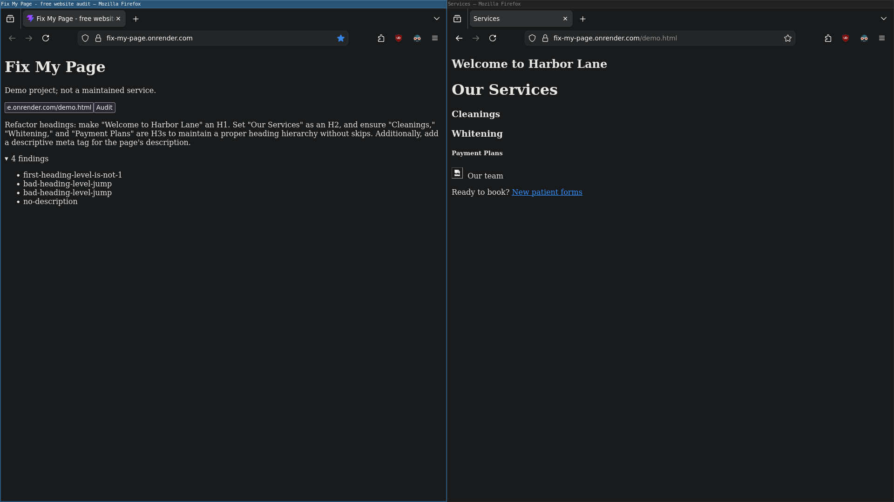

Paste a URL and get a plain-English report on what needs fixing on the page. Readable by anyone, not just the programmers.

**Now live at** https://fix-my-page.onrender.com/!



Most site auditors return a list of technical findings sorted by severity. This one is built on a different premise: what's worth fixing depends on what the page is _for_. A broken link to your payment page matters more than a dozen missing alt attributes, and no simple chart could know that. Instead, the check reports the facts and a language model does the inference, ranking, and writing.

## How it works

```
fetch -> parse -> deterministic checks -> findings -> LLM -> prose
```

Nothing about the page is inferred by the model; each finding comes from deterministic code, so a problem in the report is a problem that's actually on the page. The model's job is to decide which findings matter and to say so in language that a client can understand and act on. It also picks the shape of its own answer; one real problem gets one sentence while a genuinely broken page gets a full report.

## What it checks


| Check            | Finds                                                                  |
| ---------------- | ---------------------------------------------------------------------- |
| Title            | Missing or present-but-empty tag                                       |
| Headings         | No headings, not opening with `h1`, multiple `h1`s, and skipped levels |
| Meta description | Missing, present-but-empty, and duplicate tags                         |

Each check returns _facts_ (what's on the page) and _problems_ (what's wrong with it). Findings carry the context needed to act on them, such as a skipped heading level reporting where the jump is to and from.

## Running it

```bash
nix develop # or have Node 22+ on PATH
npm install
echo "GEMINI_API_KEY=..." > .env
npm run dev # the API
cd client && npm run dev # the UI
```

One server -- a React build served by Node:

```bash
npm run build
npm start
```

Checks can be exercised against fixtures with no network and no API key:

```bash
node --watch scratch.js
```

Without `GEMINI_API_KEY` or in the case of a problem such as a rate limit, the audit still runs and renders the findings without the LLM report.

## Design notes for interviewers

Checks report facts, not severity. Tagging each finding high/medium/low inside the check that produces it would have been easy and incorrect. Severity depends on what the page is trying to accomplish, and the layer that counts `` tags doesn't know that. Ranking happens where the context is.

Presentation stays out of the check layer. An early version emitted findings as formatted strings: `"Our Services (h1) -> Cleanings (h3)"`. That's convenient once and tedious afterwards. Findings are structured; prose is generated downstream.

Missing and empty are different problems. An absent `<meta description>` and one with `content=""` need different advice: write a description, versus find the empty CMS field that's already wired up. Telling someone to add a tag they already have is how you produce a _third_ problem: two competing description tags. Findings are split by what fixes them, not by what they look like.

The format choice is made after the prose, not before. The model writes its recommendation first and labels the format second so that the category describes the artifact rather than influencing it. Formatting is a novelty right now but will be crucial when site-wide audits are implemented.

There are two test pages -- one broken and one working perfectly. `fixtures/messy.html` is broken on purpose and yields four findings. `fixtures/clean.html` is the same page done right, and the assertion is that it yields zero problems; a check that fires on a well-built site teaches the reader to distrust the whole report.

The auditor refuses private addresses. A service that fetches arbitrary URLs is an SSRF hole by default: hand it `http://169.254.169.254/` and it will return potentially private cloud metadata. `safety.js` resolves each hostname and rejects loopback, private, and link-local answers by checking _resolved addresses_ rather than hostname strings. Redirects are followed manually so every hop is checked, not just the first. A consequence of this is that pages which redirect many times may not have the final destination audited.

The project's stack consists of React (Vite), Node, Cheerio, Gemini, Render, and Nix. There is one runtime dependency for the server: Node's built-in `http` plus Cheerio for parsing -- no framework because the problem didn't need one.

## Known limitations

- JavaScript is not executed.
- DNS rebinding is not mitigated.
- One page per audit.
- Free-tier API limits.
- Byte counts use UTF-16 code units.

## Roadmap

- More checks.
- Empty-shell detection.
- Site-wide audits.
- Link-graph building.
- Webhook trigger.
